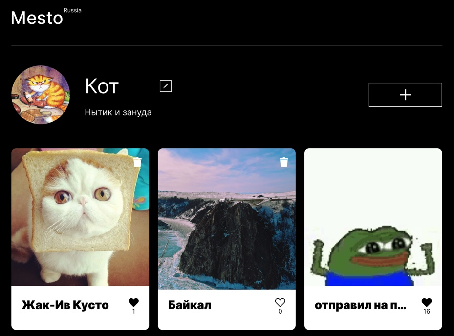
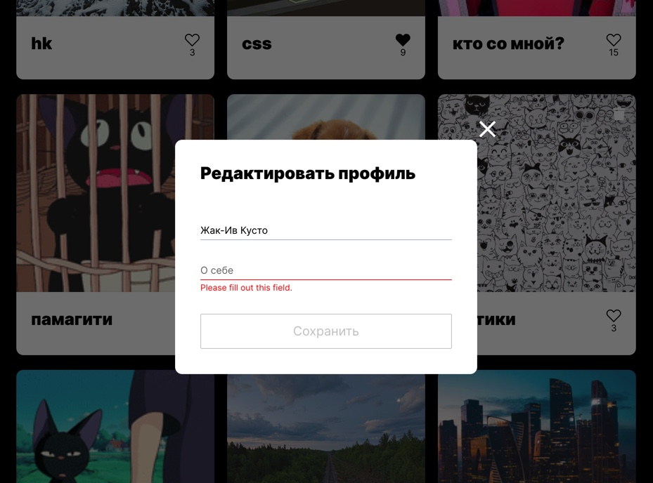

# Mesto
Опубликованный проект **Место на React**  можно посмотреть **[здесь](https://yuliaiv-iv.github.io/mesto-react)**

### Описание

Интерактивный сервис с элементами соц сети переписанный на React. Можно опубликовывать и удалять созданные карточки. Реализация постановки и снятие лайка, просмотр фотографий в увеличенном формате. Возможность обновлять инфо и аватар юзера. Реализована регистрация и авторизации пользователя, переадресация, защита маршрутов

### Технологии

* **`ReactJS`**
* **`HTML5, CSS3`**
* **`Адаптивная верстка`** с использованием **`медиа-запросов`**
* **`Flex`** и **`Grid-layout`**
* Live **`валидация форм`**
* * **`Fetch запросы`** 
* **`API`**

### Методологии
* ООП
* БЭМ

### Запуск и установка
* `npm install` устанавка модулей, перечисленных как зависимости в package.json
* `npm start` запустить проект

### Figma 
**[Ссылка](https://www.figma.com/file/StZjf8HnoeLdiXS7dYrLAh/JavaScript.-Sprint-4)** на макет в Figma

    
    

